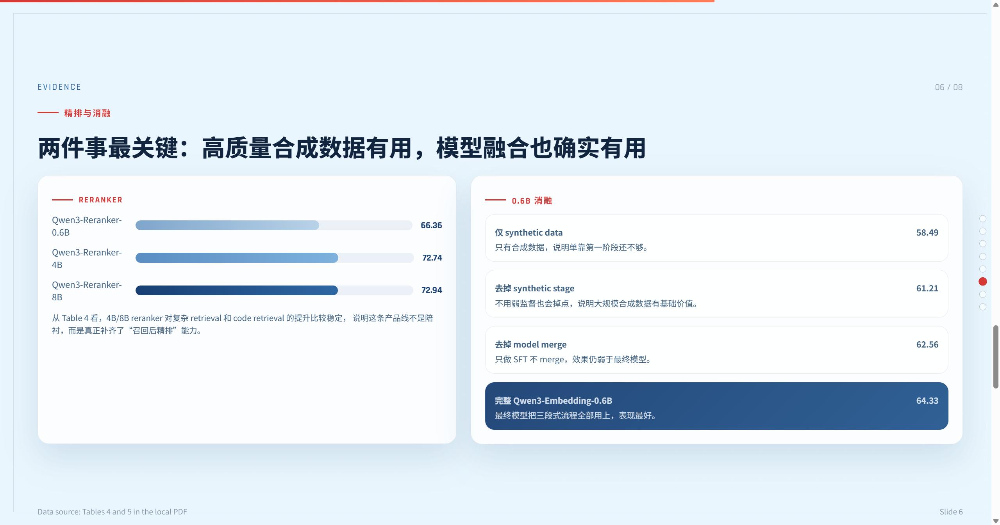
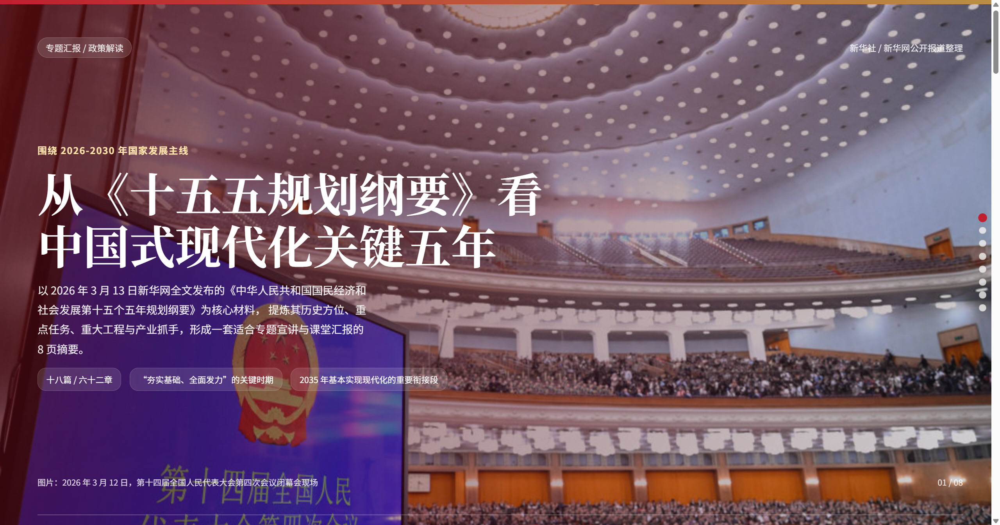
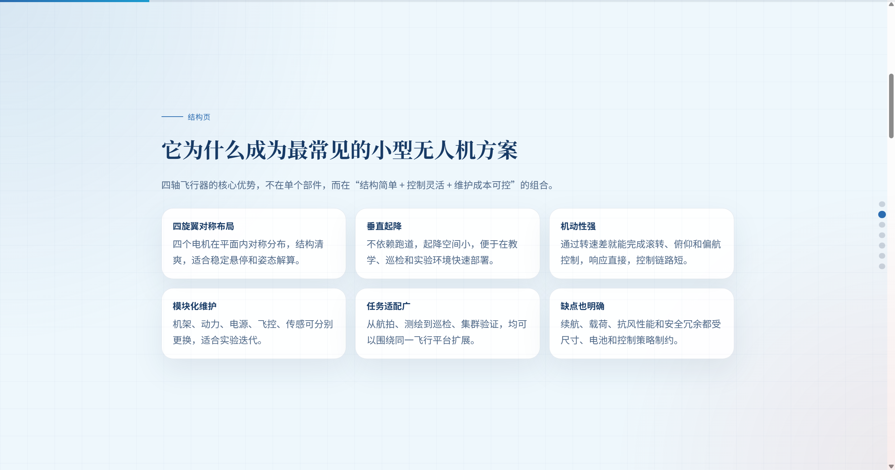
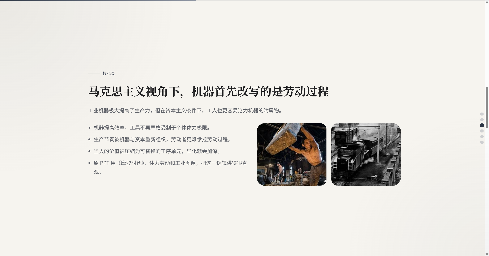
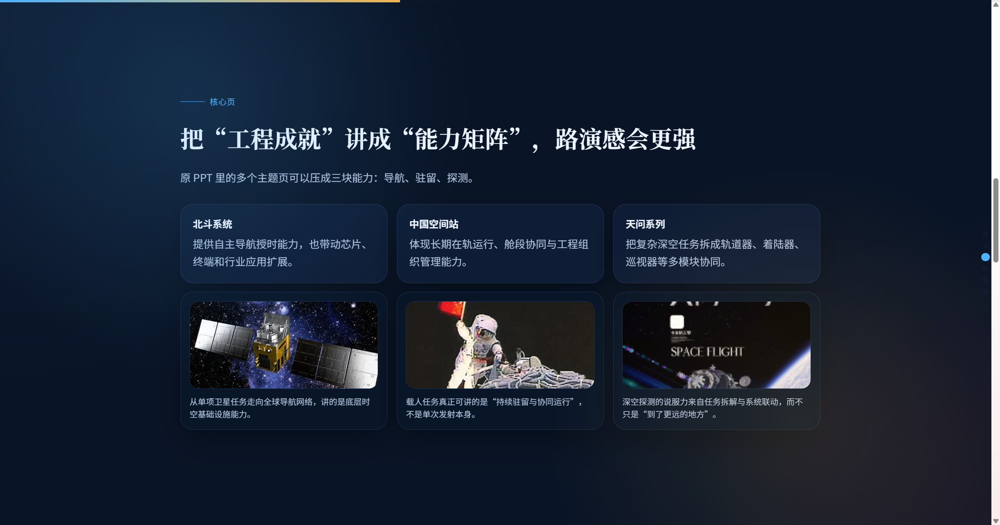
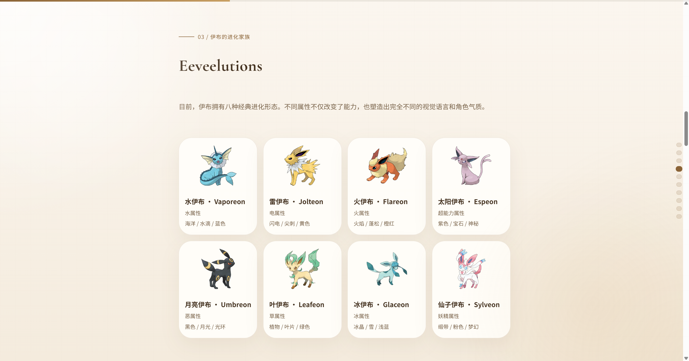

# html-slide-template-library

A standalone HTML slide template library distilled from my own presentation work.

This repository focuses on **shareable, self-contained HTML slide outputs** for six recurring presentation scenarios:

- Academic defense
- Policy briefing
- Engineering and technical explanation
- Theory and classroom discussion
- Innovation roadshow
- Community and collectible showcase

All templates are plain HTML bundles with local assets. There is **no build step**, **no framework dependency**, and **no bundled third-party skill code**.

## What This Repository Is

This is a curated template library for reusable HTML slide directions.

It is meant to be:

- a personal HTML slide style library
- a clean open-source artifact that can be shared independently
- a reusable base for future slide-generation workflows

It is **not**:

- a dump of Codex system skills
- a mirror of third-party template packs
- a mixed workspace archive
- a repository of temporary export artifacts

## What Is Included

### Core template scenarios

| Scenario | Directory | Notes |
| --- | --- | --- |
| Academic defense | `templates/academic-defense-qwen3/` | Evidence-first, blue-white, paper-presentation style |
| Policy briefing | `templates/policy-plan15/` | Red-gold institutional briefing style |
| Engineering / technical | `templates/engineering-quadcopter/` | Structured grid, technical explanation, modular content |
| Theory / classroom | `templates/theory-marx-ai/` | Black-white-light editorial discussion style |
| Innovation roadshow | `templates/innovation-aerospace/` | Capability-matrix storytelling and strong pitch framing |
| Community / catalog | `templates/community-cat-catalog/` | Card-based collectible and showcase direction |

### Additional example

| Example | Directory | Notes |
| --- | --- | --- |
| Community adaptation example | `examples/community-eevee-pokedex/` | A Pokemon Pokedex adaptation based on the community showcase direction |

## Repository Structure

```text
html-slide-template-library/
├─ templates/
│  ├─ academic-defense-qwen3/
│  │  ├─ index.html
│  │  └─ assets/
│  ├─ policy-plan15/
│  │  ├─ index.html
│  │  └─ assets/
│  ├─ engineering-quadcopter/
│  │  ├─ index.html
│  │  └─ assets/
│  ├─ theory-marx-ai/
│  │  ├─ index.html
│  │  └─ assets/
│  ├─ innovation-aerospace/
│  │  ├─ index.html
│  │  └─ assets/
│  └─ community-cat-catalog/
│     ├─ index.html
│     └─ assets/
├─ examples/
│  └─ community-eevee-pokedex/
│     ├─ index.html
│     └─ assets/
├─ assets/
│  └─ readme/
│     └─ screenshots used in this README
├─ README.md
└─ LICENSE
```

## Routing Logic

These templates were organized around six stable use cases rather than around visual labels alone.

| If the content is mainly... | Start here |
| --- | --- |
| research findings, evidence walls, method/result explanation | `academic-defense-qwen3` |
| policy interpretation, state planning, institutional public briefing | `policy-plan15` |
| system structure, mechanism explanation, engineering principle | `engineering-quadcopter` |
| concept-heavy, argumentative, classroom or discussion-led | `theory-marx-ai` |
| pitch-like storytelling, capability framing, innovation narrative | `innovation-aerospace` |
| catalog, collection, community showcase, fandom-style display | `community-cat-catalog` |

## Example Gallery

The following screenshots were renamed from raw workspace exports to stable, content-based filenames.

### 1. Academic defense

`assets/readme/01-academic-defense-reranker-ablation.png`



### 2. Policy briefing

`assets/readme/02-policy-plan15-cover.png`



### 3. Engineering / technical explanation

`assets/readme/03-engineering-quadcopter-advantage-grid.png`



### 4. Theory / classroom discussion

`assets/readme/04-theory-marx-labor-process.png`



### 5. Innovation roadshow

`assets/readme/05-innovation-aerospace-capability-matrix.png`



### 6. Community adaptation example

`assets/readme/06-community-eevee-eeveelutions.png`



## How To Use

### Open a template directly

Each template is self-contained. Open `index.html` in a browser:

- `templates/academic-defense-qwen3/index.html`
- `templates/policy-plan15/index.html`
- `templates/engineering-quadcopter/index.html`
- `templates/theory-marx-ai/index.html`
- `templates/innovation-aerospace/index.html`
- `templates/community-cat-catalog/index.html`

### Reuse as a starting point

Recommended workflow:

1. Pick the closest scenario directory.
2. Duplicate the whole folder.
3. Replace text and local assets inside that duplicated folder.
4. Keep relative asset paths unchanged when possible.
5. Export screenshots or publish the folder directly.

## Design Principles

These templates follow a few stable constraints:

- self-contained HTML first
- local assets over remote dependencies
- clear scenario routing before visual styling
- structured layouts that survive real presentation density
- reusable visual language rather than one-off decoration

## Boundary Statement

This repository intentionally excludes:

- Codex system skill files
- external bundled skill definitions
- unrelated workspace artifacts
- temporary PPT export folders not required by the HTML templates
- generated files whose only purpose was local testing

## License

MIT License. See [LICENSE](LICENSE).
