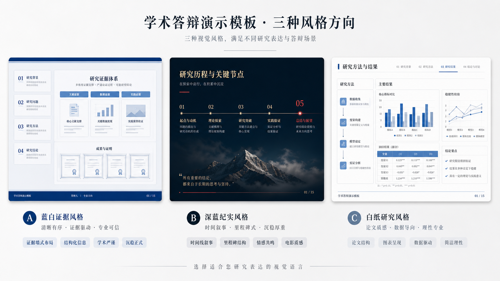

# html-slide-template-library

A shareable Codex skill for **template selection and style routing** before HTML slide generation.

**Language / 语言**

[English](#english) | [简体中文](#zh-cn)

---

<a id="english"></a>

## English

Switch language: [简体中文](#zh-cn)

### What This Repository Actually Is

This repository is the **skill body itself**, not a gallery of finished example decks.

Its job is to help Codex:

- classify a slide task into one of six presentation families
- recommend 3 to 6 template directions from this library
- explain which direction is the safe default
- hand off a concrete style brief to a downstream slide generator

This repository is for **template choice first**, not for directly shipping six demo HTML files.

### What The Skill Covers

The skill routes slide tasks into these six families:

1. Academic defense
2. Policy and governance
3. Engineering and technology
4. Theory and coursework
5. Innovation roadshow
6. Community portfolio

Each family contains three subtemplate directions, for a total of 18 first-party directions in this repository.

### What Is Included

| Path | Purpose |
| --- | --- |
| `SKILL.md` | Trigger conditions, workflow, and handoff contract |
| `agents/openai.yaml` | UI metadata for the skill |
| `references/selection-workflow.md` | How Codex should shortlist and compare directions |
| `references/template-families.md` | The six families and all 18 subtemplate directions |
| `references/style-dna.md` | The owner's stable narrative and visual defaults |
| `assets/previews/` | Preview boards for the six top-level families |

### What Is Not Included

This repository intentionally does **not** treat the following as the main product:

- finished example decks as the skill body
- third-party skill code
- Codex system skill contents
- deployment scripts
- HTML-to-PPT conversion logic

If you want actual HTML slide generation after template choice, pair this skill with your generator workflow, for example `frontend-slides`.

### Install

Clone or copy this repository into your Codex skills directory:

```text
$CODEX_HOME/skills/html-slide-template-library
```

On Windows, a common location is:

```text
C:\Users\<you>\.codex\skills\html-slide-template-library
```

After placement, Codex can discover the skill by folder name.

### How It Works

The intended interaction is:

1. The user asks for a slide deck, or asks to use this template library.
2. Codex uses this skill to classify the task into one of the six families.
3. Codex recommends 3 to 6 candidate directions from this repository.
4. Codex explains each candidate in a fixed format:
   - Template
   - Why it fits
   - What it will look like
   - Risk
5. The user chooses one direction, one primary plus one secondary, or lets Codex pick the safest default.
6. Codex then passes that chosen direction into a deck-generation workflow.

### Preview Gallery

These preview boards represent the six top-level families that this skill routes through.

#### 1. Academic defense



#### 2. Policy and governance


#### 3. Engineering and technology


#### 4. Theory and coursework


#### 5. Innovation roadshow


#### 6. Community portfolio


### Recommended Use

Use this skill when:

- the user asks for template recommendations before generation
- the user asks to follow this personal slide system
- the task should be routed by scenario instead of by vague mood labels
- you want a stable, reusable selection layer before generating HTML slides

### License

MIT License. See [LICENSE](LICENSE).

Back to top: [English](#english) | [简体中文](#zh-cn)

---

<a id="zh-cn"></a>

## 简体中文

切换语言：[English](#english)

### 这个仓库真正是什么

这个仓库是一个 **Codex skill 本体**，不是 6 个演示 HTML 成品的陈列仓库。

它的职责是帮助 Codex：

- 先把用户的 slide 任务归类到六大模板体系之一
- 从这套体系里推荐 3 到 6 个模板方向
- 说明哪个方向是最稳妥的默认项
- 把最终选中的方向交给后续生成工作流继续产出 HTML slide

也就是说，这个仓库的核心是 **模板选择与风格路由**，不是示例页面本身。

### 这个 skill 管什么

这个 skill 把 slide 任务统一路由到六大类：

1. 学术答辩类
2. 党政政策类
3. 工程技术类
4. 理论课程类
5. 创新路演类
6. 社群作品集类

每一类下面再细分为 3 个子方向，总计 18 个一方模板方向，全部都来自这个仓库自身。

### 仓库包含什么

| 路径 | 作用 |
| --- | --- |
| `SKILL.md` | skill 的触发条件、使用流程和下游交接规则 |
| `agents/openai.yaml` | skill 的 UI 元数据 |
| `references/selection-workflow.md` | Codex 应该怎样做模板推荐与对比 |
| `references/template-families.md` | 六大类与 18 个子模板方向的完整定义 |
| `references/style-dna.md` | 这套个人 slide 系统的稳定风格共性 |
| `assets/previews/` | 六大类总览预览板 |

### 仓库不把什么当主体

这个仓库明确不把下面这些内容当成 skill 主体：

- 6 个现成 HTML 示例页面
- 第三方 skill 代码
- Codex 系统 skill 内容
- 在线部署脚本
- HTML 转 PPT 的实现逻辑

如果后续需要真的生成 HTML slide，可以把这个 skill 和生成工作流搭配使用，例如 `frontend-slides`。

### 安装方式

把这个仓库克隆或复制到 Codex skills 目录下：

```text
$CODEX_HOME/skills/html-slide-template-library
```

Windows 常见路径是：

```text
C:\Users\<你自己的用户名>\.codex\skills\html-slide-template-library
```

放到这个目录后，Codex 就可以按文件夹名发现这个 skill。

### 这个 skill 怎么工作

推荐使用流程如下：

1. 用户提出一个 slide 任务，或者明确说要用这套模板库。
2. Codex 用这个 skill 先判断它属于六大类中的哪一类。
3. Codex 从仓库内推荐 3 到 6 个候选方向。
4. 每个候选都按固定格式说明：
   - Template
   - Why it fits
   - What it will look like
   - Risk
5. 用户再选择：
   - 一个方向
   - 一个主方向加一个副方向
   - 或者让 Codex 直接选最稳妥默认项
6. 确认方向后，再交给后续生成流程产出真正的 deck。

### 预览总览

下面这些预览板对应这个 skill 的六大顶层模板类目。

#### 1. 学术答辩类


#### 2. 党政政策类


#### 3. 工程技术类


#### 4. 理论课程类


#### 5. 创新路演类


#### 6. 社群作品集类


### 适用场景

下面这些情况适合直接触发这个 skill：

- 用户在生成前想先看模板推荐
- 用户要求沿用这套个人 slide 系统
- 任务更适合按场景路由，而不是只按“专业、现代、极简”这种模糊词来选
- 你希望先有一层稳定的模板选择，再进入 HTML slide 生成

### 许可证

采用 MIT License，详见 [LICENSE](LICENSE)。

返回顶部：[English](#english) | [简体中文](#zh-cn)
